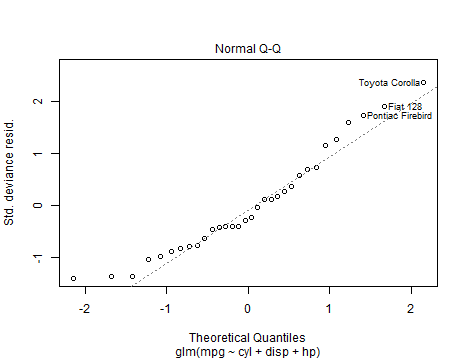
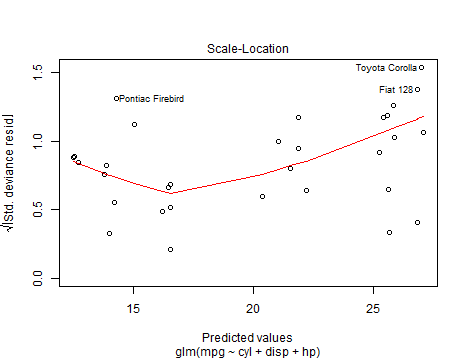
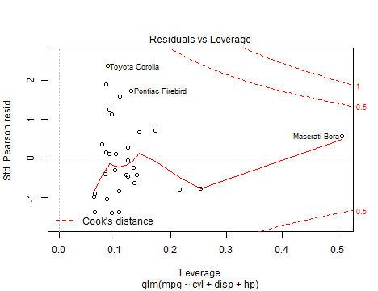
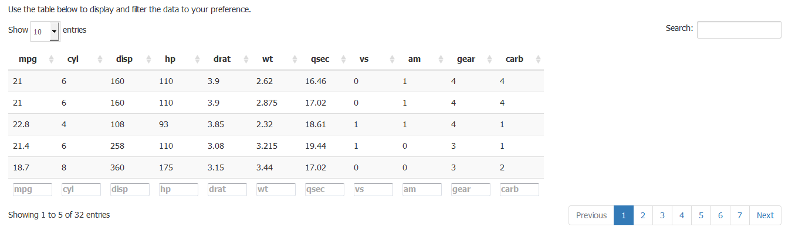

Developing Data Product
========================================================
author: Amirrudin Bin Dahlan
date: 15th Feb 2015
width: 2000
height: 1000

Linear Modelling on mtcars Data

Introduction
========================================================
1. The mtcars data set contains data from the 1974 Motor Trend US magazine.
It comprises fuel consumption and 10 aspects of automobile design and 
performance for 32 automobiles (1973-74 models).

2. The requirement is to create a linear model using R and present it via
shinyapps within the context of mtcars data set. 

3. An online Shiny solution will allow a user to choose any dimensions to be
the predictor for the fuel consumption of the automobiles, miles-per-gallon (mpg).

4. Upon selection of the predictors, a series of charts will appear, showcasing 
the strength of the selected dimensions which affects the overall 
miles-per-gallon (mpg). 

5. Please refer to this URL for the Shiny solution: 
http://amirrudin.shinyapps.io/DDP_project/

Column Definition
========================================================
Below are the column names of data set.
<small>

```r
names(mtcars)
```

```
 [1] "mpg"  "cyl"  "disp" "hp"   "drat" "wt"   "qsec" "vs"   "am"   "gear"
[11] "carb"
```
***
Here are the definition of each column name.
- mpg  - Miles/(US) gallon
- cyl  - Number of cylinders
- disp - Displacement (cu.in.)
- hp   - Gross horsepower
- drat - Rear axle ratio
- wt	 - Weight (lb/1000)
- qsec - 1/4 mile time
- vs	 - V/S
- am	 - Transmission (0 = automatic, 1 = manual)
- gear - Number of forward gears
- carb - Number of carburetors
</small>

Output of mpg based on selection of predictors
========================================================
<small>

1. As mentioned in the earlier part of the slides, the Shiny application is hosted and made
available for the users via the web. 

2. The URL as mentioned: http://amirrudin.shinyapps.io/DDP_project/

3. The selection of the predictors is not limited to one. Multiple dimensions can be chosen
to determine the mpg.

4. The example on the right shows 3 chosen dimensions namely: cyl, disp and hp. The output is the result of linear regression of the mpg based on the chosen dimensions.  

***

```r
summary(glm(formula = mpg~cyl+disp+hp, data = mtcars))
```

```

Call:
glm(formula = mpg ~ cyl + disp + hp, data = mtcars)

Deviance Residuals: 
   Min      1Q  Median      3Q     Max  
-4.089  -2.085  -0.774   1.397   6.918  

Coefficients:
            Estimate Std. Error t value Pr(>|t|)    
(Intercept)  34.1849     2.5908   13.19  1.5e-13 ***
cyl          -1.2274     0.7973   -1.54    0.135    
disp         -0.0188     0.0104   -1.81    0.081 .  
hp           -0.0147     0.0147   -1.00    0.325    
---
Signif. codes:  0 '***' 0.001 '**' 0.01 '*' 0.05 '.' 0.1 ' ' 1

(Dispersion parameter for gaussian family taken to be 9.335)

    Null deviance: 1126.05  on 31  degrees of freedom
Residual deviance:  261.37  on 28  degrees of freedom
AIC: 168

Number of Fisher Scoring iterations: 2
```
</small>

The Visualizations
========================================================
1. After selecting the predictors, 4 charts will be shown. 

2. On the right are the outputs for the user to analyze the summary via the visualizations.

3. It shows 3 chosen dimensions namely, cyl, disp and hp, on the mpg.
<large>

***

```r
plot(glm(formula = mpg~cyl+disp+hp, data = mtcars))
```

    
</large>

Other Summary 
========================================================

Last but not least use the table below to display and filter the data set to your preference.



<h2><bold><center>-- The End --</center></bold></h2> 
